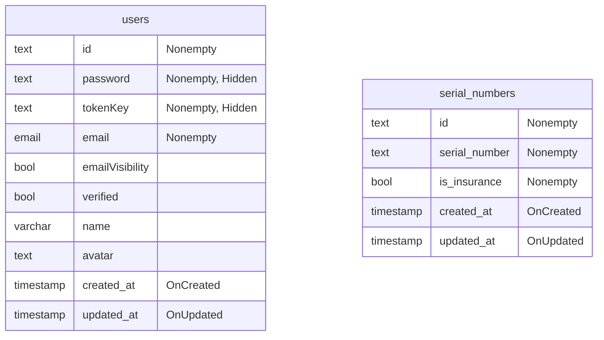

# sn insurance check
PocketBaseのサンプルで作った、端末の保険状態を確認するツール。
目的の端末のSerial Numberを入力して、検索をかけるだけ

----

GitHub Copilotの利用も兼ねた実験なので`.github`もignoreしてない


# schema
PocketBaseデフォルトのUserコレクション（Auth）と、ふつうのSerialNumbersコレクション（Base）が存在する。relationはない。以上。


# release
フロントエンドコードをembedしたgoのバイナリファイルを適当なサーバーに置くのを想定

```sh
go run main serve --http localhost:8090
```